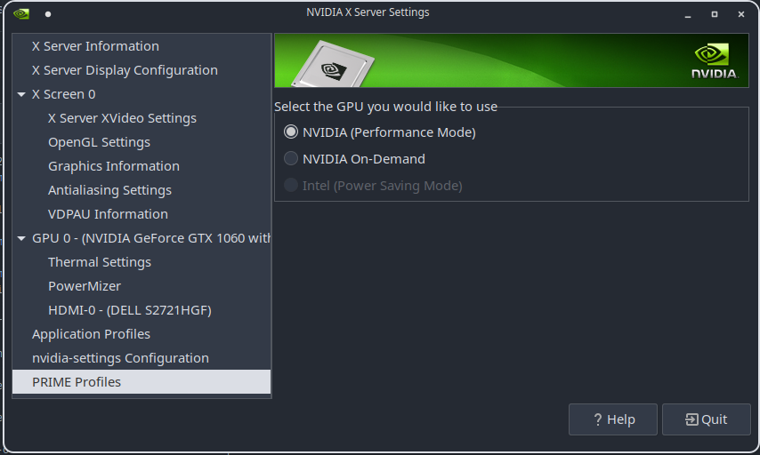
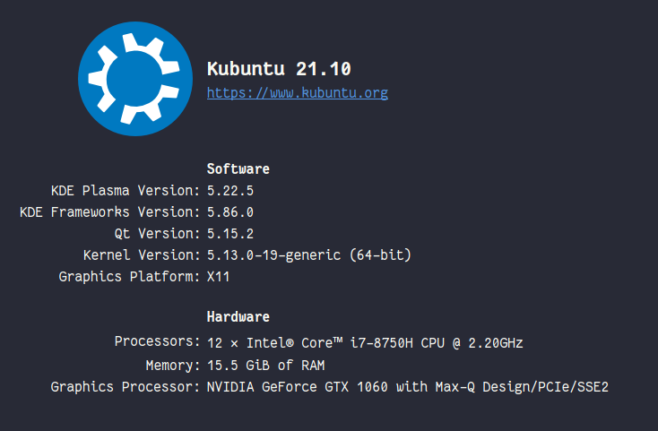
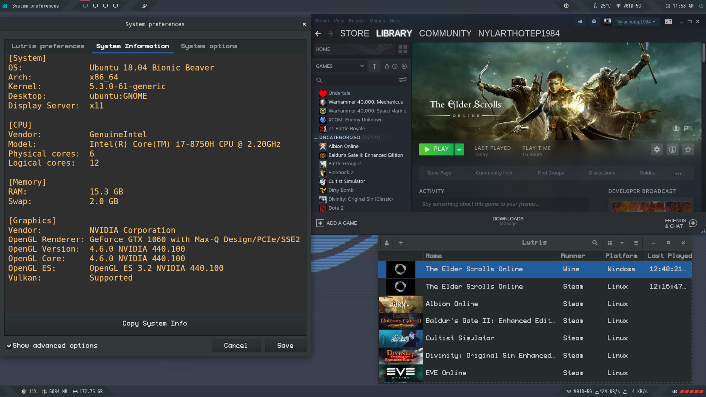
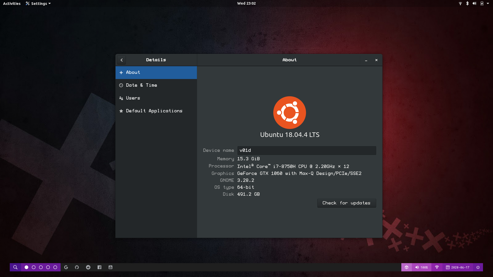
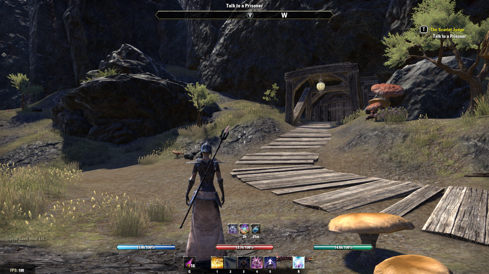

### EDIT: Feb 2022 Tested & Confirmed on Kubuntu 21.10  -- Once Installed open nvidia settings and change prime profile to performance -- this will activate the drivers & settings desired to accomplish this.

Proper Installation of Nvidia Drivers on Ubuntu 18.04 (tested and confirmed).

Make your driver executable

$ chmod +x driver.run

Install depends (which should be installed by default on 18.04)

$ sudo apt-get install gcc & cmake

Blacklist the Nouveau drivers in kernel

$ sudo bash -c "echo blacklist nouveau > etc/modprobe.d/blacklist-nvidia-nouveau.conf"

$ sudo bash -c "echo options nouveau modset=0 >> etc/modprobe.d/blacklist-nvidia-nouveau.conf"

Update Kernel with the Blacklist

$ sudo update-initramfs -u

Reboot

$ sudo Reboot

Terminal only login (perform at login screen)

$ Ctrl+Alt+F3

Login to the terminal only mode, then install Drivers

$ sudo telinit 3

$ sudo bash driver.run

answer how your system guides, reboot and done!

$ reboot

ESO Running With Lutris

