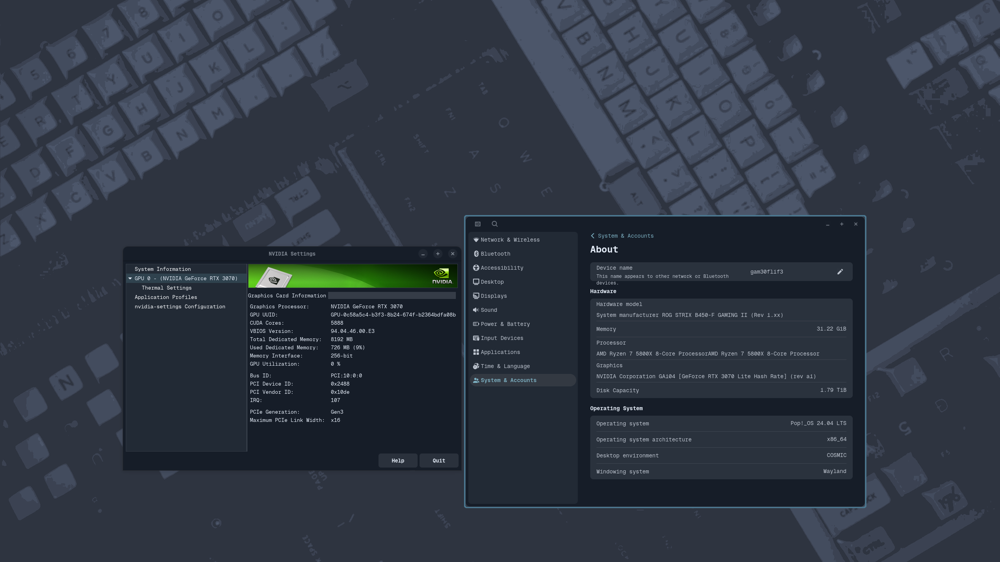

Update : Currently working with Ubuntu 24 LTS PopOS 22 & 24
 
 # Cut all the antiquated technical BS out of this, its all depreciated anyway thankfully.  They've made this really straight forward.
   # ㄩ尸ᗪ闩七🝗ᗪ : September 2025
 


## Step 1 First comes first, lets get your drivers ##

https://www.nvidia.com/en-in/drivers/

## Step 2 Make your driver executable ##

```chmod +x driver.run```

## Step 3 Install depends (which should be installed by default on 18.04) ##

```sudo apt-get install gcc & cmake```

## Step 4 start the installation, continue to install anyway if prompted, at the end you do not want to edit ##

```sudo bash driver.run```

## answer how your system guides, reboot and done! ##

```sudo reboot```

**As of Ubuntu 24 and newer PopOS you no longer have to blacklist.  Also the drviers can be installed in a normal terminal, no need to login terminal only.**



As you can see Wayland on PopOS at least hasn't carried over all the Nvidia settings quite yet, I know for a fact Ubuntu has but with Ubuntu 24LTS based distros
my performance is utter garbage in Ubuntu whereas PopOS is nice and smooth sitting close to 200fps in POE2 Highest.


